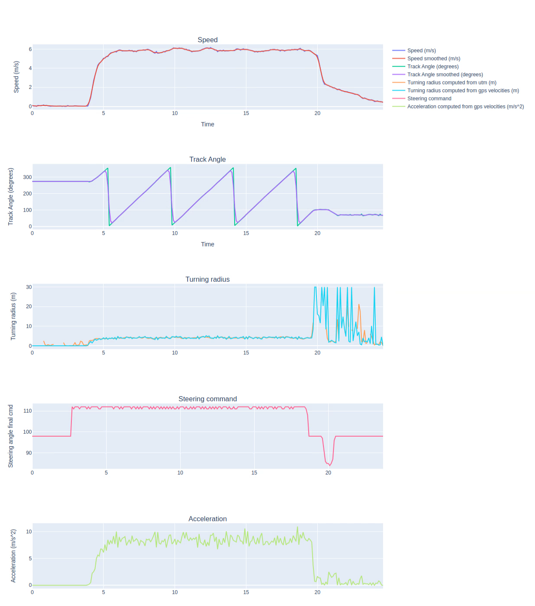
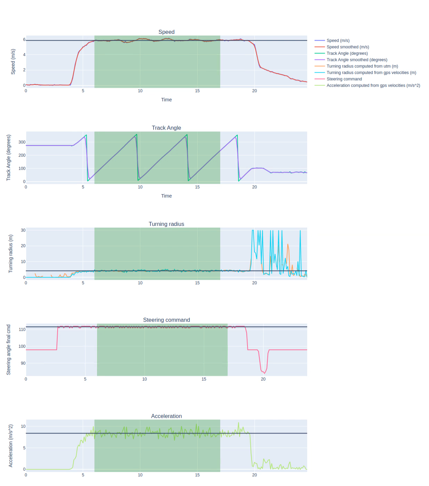
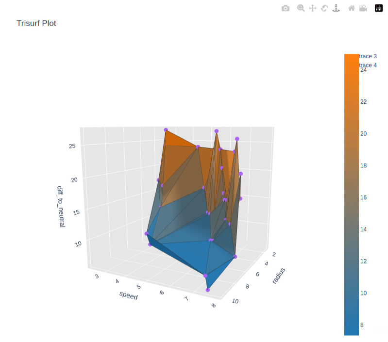

# Scripts to do some parameter identification for the steering

## What is this

Set of scripts to do parameter identification for the steering of the RC car, in order to create a steering model closer to the reality.

## Steps

- record multiple bags of the car driving in a circle, at different speeds and circle radiuses
- put the bags in a folder
- pass this folder as argument to `steering_param_identification.py`
- for each bag, the script will generate a plotly html and ask you to enter the start and end time of the window of interest
    - open the html
    - pass the start time of the window where the car was driving in a circle
    - pass the end time of the window where the car was driving in a circle
    - re-open the HTML to make sure that the window and calculated average values look good
    - press enter if so
- pass the generated CSV to `csv_processor.py`
- check the generated plotly HTML

## Results

The CSV has been used to improve the steering model, see https://github.com/roux-antoine/self-racing-rc-platform/pull/18/files#diff-9610bc43a27d91df0c97542873b8bd770d34c94b8bfa7c0dc9cb0b21338fd278 and https://github.com/roux-antoine/self-racing-rc-platform/blob/master/autonomy_software/doc/Lateral_Controller_self_racing_rc_platform.pdf

## Example images

Plotly HTML from `steering_param_identification.py`

Plotly HTML from `steering_param_identification.py` for window validation

Plotly HTML from `csv_processor.py`

