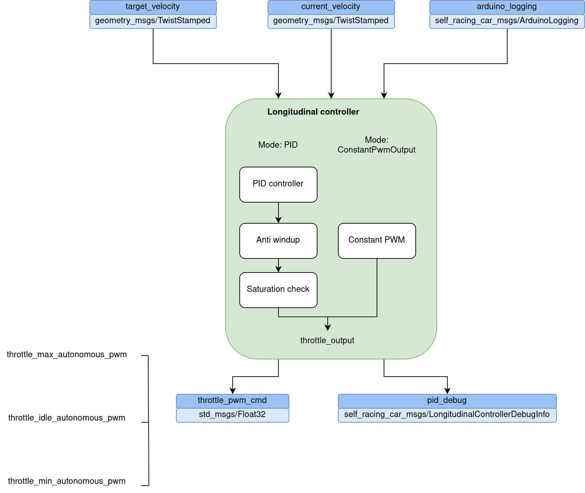

# Controllers

## Lateral controller

TODO

## Longitudinal controller

### Usage

```console
$ source devel/setup.bash
$ rosrun controllers_pkg longitudinal_controller.py
```

### Parameters
| Parameter | Default | Description |
----------|-----|--------
|`rate`|*10* |Frequency (Hz) of controller's main loop|
|`throttle_idle_autonomous_pwm`|*90* |Throttle pwm for vehicle to stay idle|
|`throttle_max_autonomous_pwm`|*102* |Max throttle pwm|
|`throttle_min_autonomous_pwm`|*70* |Min throttle pwm|
|`longitudinal_control_mode`|*2* |1: Constant PWM output, 2: PID|
|`speed_control_gain_p`|*0.5* |PID proportional gain|
|`speed_control_gain_i`|*0.1* |PID integral gain|
|`speed_control_gain_d`|*0* |PID derivative gain|
|`constant_pwm_output`|*90* |Throttle pwm output is mode is Constant PWM output|
|`timeout_engage_msg_before_stop_secs`|*1* |Time in seconds after which an engage message is no longer valid and the controller is stopped|

### How it works

The longitudinal control has two modes:
- ConstantPwmOutput: The controller's output is constant and set as a parameter
- PID: The controller's output is derived using a PID controller



### Future improvements

- Feedforward term
