# Vehicle models

This README is a copy from Antoine's Notion page: [Self-racing RC platform Lateral controller design (Part 1, 2024-2025)](https://www.notion.so/antoineroux/Self-racing-RC-platform-Lateral-controller-design-part-1-2024-2025-26adcb5ad6ce48fc89e0aa7f1e6030d2)

# 1. Goals


## 1.a. The context

As a follow up of the project described in [this Notion page](https://www.notion.so/Self-racing-RC-car-2022-dd31e084b6a941a883cd31b5fcdf2153?pvs=21) (building a small self-driving car from a hobby radio-controlled car), my friend Mattia and I bought a bigger and faster RC car, a more powerful onboard computer and a differential GPS.

One thing that we carried over from the first project into the new one is the lateral controller: a basic pure pursuit with a very basic steering model for the vehicle. But with a faster vehicle, the limits of this basic approach became even more obvious. So, in this article, I’ll describe the initial model that have use, and what I’ve done to come up with a better lateral control.

## 1.b. The starting point

In our 2022 project, we’ve followed the following high-level approach:

- For a given vehicle pose, we use a pure-pursuit algorithm to compute the desired point
- We consider that our vehicle follows a bicycle model, and use this model to compute the radius of the circle required to reach the desired point
- We build a steering model of the vehicle to compute the steering servo command required to follow a circle of the given radius

Which can be represented as:

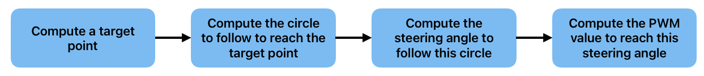

In the coming section, I’ll present this simple model and the derivations of its different components.

# 2. Version 0: pure pursuit, bicycle model

## 2.a. The pure pursuit

Pure pursuit is an algorithm to compute the arc that a vehicle needs to follow to reach a target point.

For our use-case of having the car follow a pre-defined path, we use it to:

1. Compute a target point
2. Compute the radius of the circle that the car needs to follow to reach the target point

### 2.a.1. Computing the target point

To illustrate how the target point is computed, I’ll use the video below (generated from a real drive with the RC car).

In the video:

- the blue dot represents the car
- the black dots represent the waypoints of the pre-defined path
- the red line represents the direction of the car
- (the other symbols we’ll go through later)

The idea of the pure pursuit is to create a target point which is on the pre-defined path, at a given distance ahead of the vehicle. This distance is called the **lookahead distance**.

Here is how it translates in terms of the steps of the algorithm:

1. Create a circle of radius `lookahead_distance` around the vehicle, called `lookahead_circle`.
2. Compute the line between the two points just inside and outside of the `lookahead_circle`, in the direction of the vehicle.
3. Compute the intersection between the `lookahead_circle`  and this line, to serve as the target point.

There are a few edge cases to consider (no waypoints left, no waypoints in the lookahead circle, etc), see the code in https://github.com/roux-antoine/self-racing-rc-platform/blob/master/autonomy_software/planning_pkg/src/target_generator.py for details.

The circle to follow to reach the target point is defined as the circle passing through the vehicle and through the target point, tangent to the vehicle direction. This is the blue circle in the video above.

Let’s jump into the derivations for this circle in the next subsection.

### 2.a.2. Computing the radius of circle to follow

To compute the radius of the circle to follow (called $R$), we can simply do a bit of geometry. Let’s consider the following drawing representing the car, the target and the circle to follow:

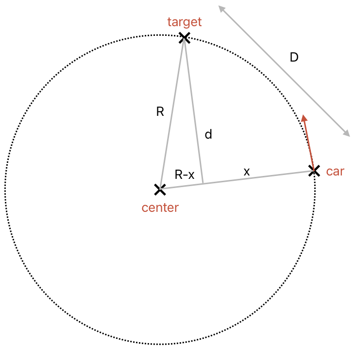

Using Pythagoras in the big triangle, we have:

$$
\begin{split}
& R^2 = d^2 + (R-x)^2 \\
& R^2 = d^2 + R^2 + x^2 -2 R x \\
& R = \frac{d^2 + x^2}{2 x }
\end{split}
$$

Using Pythagoras in the small triangle, we have:

$$
\begin{split}
& D^2 = d^2 + x^2 \\
& x^2 = D^2 - d^2 \\
\end{split}
$$

We can plug it in the previous equation and get:

$$
\begin{split}
& R = \frac{d^2 + x^2}{2 x } \\
& R = \frac{d^2 + D^2 - d^2}{2 \sqrt{D^2 - d^2}} \\
& R = \frac{D^2}{2 \sqrt{D^2 - d^2}} \\
\end{split}
$$

To compute $d$, we can use the formula for the distance between a point and a line defined by a point and a direction vector (here called $normal$, as the vector normal to the car direction):

$$
d = \lVert (\texttt{target} - \texttt{car}) - (\texttt{target} - \texttt{car}) \cdot \texttt{normal} \hspace{0.25em} \texttt{normal} \rVert
$$

We can plug it in the previous equation and finally get:

$$
\boxed{R = \frac{D^2}{2 \sqrt{D^2 - \lVert (\texttt{target} - \texttt{car}) - (\texttt{target} - \texttt{car}) \cdot \texttt{normal} \hspace{0.25em} \texttt{normal} \rVert^2}}}
$$

So now, given: the distance between the car and the target as well as the position of the target and of the car (all of which are known), we can compute the radius of the circle to follow to reach the target, which is a point on the pre-define path, ahead of the vehicle.

## 2.b. The bicycle model

At this stage, we now need a way to determine what command to send to the actuators of the vehicles to follow this circle towards the target point.

To do so, we use one of the most basic approaches to model the behavior of a car: the bicycle model. It comes with some limitations (mainly that it represents a 4-wheeled vehicle as a 2-wheeled vehicle, and the fact that it does not consider the dynamics of the vehicle), but is a good starting point for us.

In the bicycle model, the vehicle is represented as a set of 2 wheels, the front one being able to steer:


The assumption is that there is no slip at the wheels, meaning that the movement of the vehicle is a circle, the center of which is the intersection of the normals at the wheels. Graphically speaking, this means:


Where:

- The distance between the 2 wheels is called the wheelbase, noted W
- The radius of the turn is noted R
- The steering angle is noted theta

Let’s now do some more geometry and derive the relation between the steering angle and the radius of the turn. We have:

$$
\alpha = \frac{\pi}{2} - \theta
$$

And (for $\alpha \neq 0$):

$$
\tan(\alpha) = \frac{R}{W}
$$

By combining the 2, we get:

$$
\begin{split}
& \tan({\frac{\pi}{2} - \theta}) = \frac{R}{W} \\
\iff & \frac{1}{\tan({\theta})} = \frac{R}{W}
\end{split}
$$

And finally:

$$
\boxed{\theta = \arctan(\frac{W}{R})}
$$

This holds true if the steering angle is different from 0, since in this case it would mean that the two normals of the wheels are parallel and never meet.

So at this stage, we have:

- an algorithm to compute the target point from known positions and quantities
- a formula to compute the radius of the turn, based on the target points
- a formula to compute the steering angle, based on the radius of the turn

In practice, the steering of the RC car is controlled by a servo motor, which is not commanded in angle, but in arbitrary PWM units. So the last step is to figure out how to go from the steering angle to the PWM command.

## 2.b. From steering angle to PWM command

To find a relation between the command sent to the servo and the angle of the front wheels, there are a few different approaches, among which:

- geometrically computing the relation between the servo horn angle and the wheel angle by measuring the lengths of steering arms etc
- sending PWM commands to the steering servo, measure how it makes the car turn and interpolate

Because it is quite tricky to measure precise lengths and angles on the vehicle, we first decided to go with the second approach, starting with only two datapoints: at a steering angle of 0 and at a steering angle of 30 degrees (the maximum what the front wheels will turn):

| PWM Command | Steering Angle (degrees) |
|-------------|-------------------------|
| 98          | 0                       |
| 125         | 30                      |

We we can define:

- STEER_IDLE_PWM = 98
- PWM_DIFF_AT MAX_STEER_ANGLE = 125−98 = 27
- MAX_STEER_ANGLE = 30 degrees

And end up with the following model:

$$
\boxed{\texttt{pwm\_command} = \texttt{STEER\_IDLE\_PWM} - \theta                \times \frac{\texttt{PWM\_DIFF\_AT\_MAX\_STEER\_ANGLE}}{\texttt{MAX\_STEER\_ANGLE}}}
$$

At this point, we could think that we’re done: we have have a way to compute the command to send to the servo motor in order to follow the pre-defined waypoints. But we made a lot of assumptions on the way there (using the bicycle model, not considering any dynamic effects, considering that the steering is perfectly linear). So we need to verify how well our model resists a reality check.

# 3.a. Version 1: evaluating the model and correcting the model using physical world measurements

When testing this lateral controller on the car for a simple motion of following a circle of a given radius, we noticed that the car was not turning enough. According to the equations derived above, a vehicle with a wheelbase of 0.406m and a maximum steering angle of 30 degrees should be able to turn on a circle of radius:

$$
\begin{split}        & \theta = \arctan(\texttt{curvature} \times \texttt{WHEELBASE})\\        \iff & \theta = \arctan(\frac{\texttt{WHEELBASE}}{\texttt{radius}})\\        \iff & \tan(\theta) = \frac{\texttt{WHEELBASE}}{\texttt{radius}}\\        \iff & \texttt{radius} = \frac{\texttt{WHEELBASE}}{\tan(\theta)}\\ 
  \end{split}
$$

(the curvature is defined as the inverse of the radius, when it is non-zero)

If we apply this formula to find the radius of the turn when the wheels are turned all the way (= at a steering angle of 30 degrees = 0.524 radians), we get:

$$
\begin{split}        & \texttt{radius\_min} = \frac{\texttt{WHEELBASE}}{\tan(\theta_\texttt{max})}\\ 
& \texttt{radius\_min} = \frac{0.4\text{ m}}{\tan(0.524)}\\ 
\text{So: } & \texttt{radius\_min} = 0.70\text{ m}\\    \end{split}
$$

However, we measured that the radius of the smallest circle we could drive on (at the slow speed we tested at) is 1.25m. This means that, for a circle of radius 1.25m, the car should turn all-the-way (i.e. 30 degrees), but the bicycle model was telling it to turn of only 17 degrees. 

To account for this effect, we’ve defined the EFFECTIVE_MAX_STEER_ANGLE: the steering angle that the car appears to have when turning the wheels all the way. Which, at the low speed we tested at, was around 17 degrees (as opposed to 30 degrees). This resulted in a adapted version of the equation:

$$
\texttt{pwm\_command} = \texttt{STEER\_IDLE\_PWM} - \theta                \times \frac{\texttt{PWM\_DIFF\_AT\_MAX\_STEER\_ANGLE}}{\texttt{EFFECTIVE\_MAX\_STEER\_ANGLE}}
$$

We can define the “steering_diff” as the angle between the current pwm_command and the pwm of the steering idle position. Which results in the following formula:

$$
\texttt{steering\_diff} = - \theta                \times \frac{\texttt{PWM\_DIFF\_AT\_MAX\_STEER\_ANGLE}}{\texttt{EFFECTIVE\_MAX\_STEER\_ANGLE}}
$$

With this updated model, the car was able to turn along circles at low speeds very precisely. We knew we might need to go for a more elaborate model at high speeds, but the current model was good enough at this point in time

# 4. Version 2: end-to-end model and region-based linear interpolation

## 4.a. Why do we need a better model?

The model described in Section 2 did the trick while we were testing at speed ranges close to the one where we did the initial measurement (below 3m/s). But, as expected, we realized that when testing at higher speeds (around 7m/s), the car was not turning enough to follow circles of the given radii. So we decided to:

- take more measurements of the relation between: speed, pwm command, and radius.
- use this data to fit a better model between the 3 parameters

## 4.b. Recording data

The process I followed was:

- send a constant PWM throttle command and send a constant PWM steering command
- record a bagfile of the car turning in circles
- ... repeat for different throttle and steering commands

So at the end, I ended up with 31 datapoints of speed, pwm command, and radius. Here they are, represented on a 2D scatter plot of speed and radius:

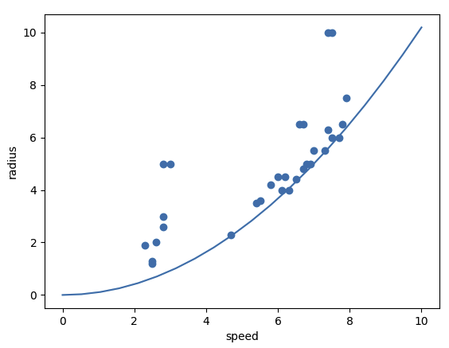

The blue line represents the pairs {speed, radius} that have a lateral acceleration of 9.81 m/s2, which illustrates the fact that I did most of the testing at the limits of lateral acceleration of the car.
Moving on to a 3D representation of the triplets {speed, radius, steering command}:

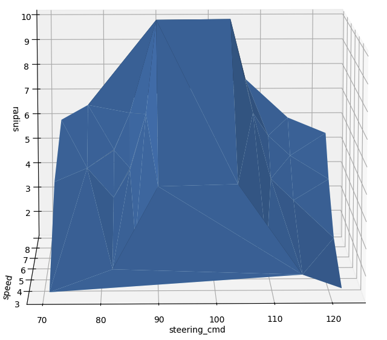

We can see that:

- The surface is mostly symmetrical around a PWM command of 98 (the steering idle), which is reassuring
- For a given PWM command (for instance 71), the radius of the circle increases with speed. This matches the observation made in testing: at high speed we need to turn more to reach the same radius

We can also generate a similar plot in 2D, that shows the relationship between the steering command and the radius, where the speed is represented by the color of the dot:


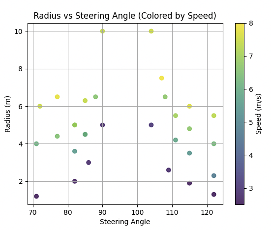


Because of the symmetry of the steering, all the further modeling can be done using the steering diff instead of the steering angle: the norm of the difference between the PWM command and 98 (the idle point of the steering).

Here is how the previous plot looks when replacing the steering command by the steering diff:

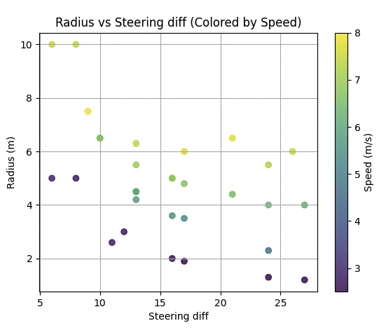

Let’s go back to the 3D plot, and swap the axes so that the radius and speed are inputs of the model, and steering diff the output:

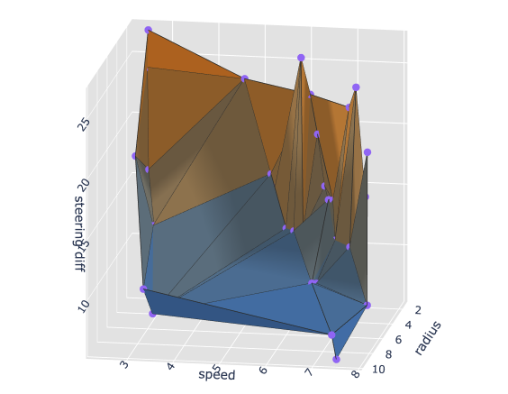


We can measure two points of interest:

- the top-left point: at a speed of 2.5m/s, turning on a circle of radius 1.2m needs a steering diff of 27.
- the second-leftmost peak point: at a speed of 6.1m/s, the same steering diff of 27 results in a circle of radius 4m.

Let’s now overlay our model from Section 2 (represented with blue dots, sampled on a grid) and see how it matches with these measured datapoints:

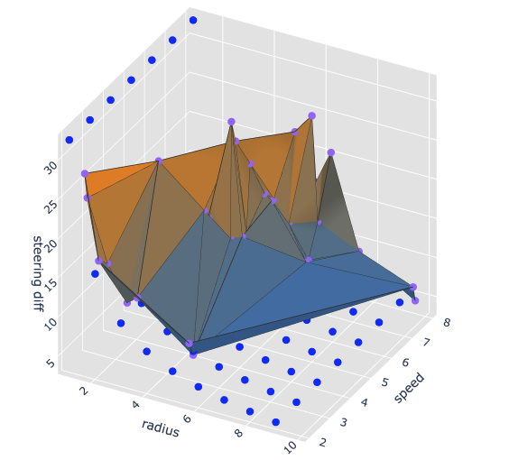

As expected, we can see that the blue dots match the surface reasonably well at low speed (zone surrounded in red below): the blue dots representing the first model are relatively close to the surface representing the reality:

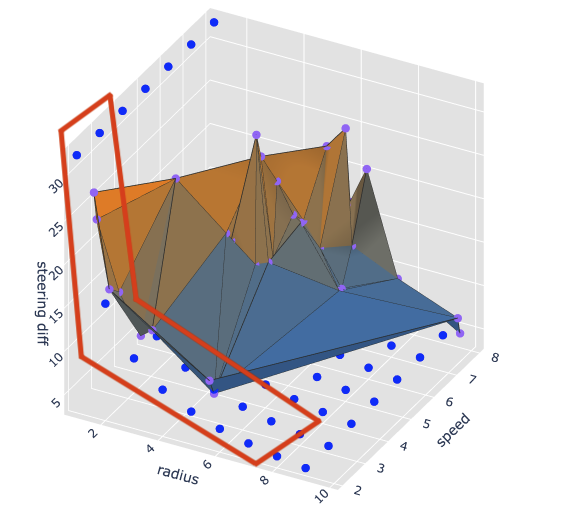

But if we now look at high speed (zone circled in red below), we can see that the blue points are very far from the surface. Meaning that the first model does not match with reality at high speeds.

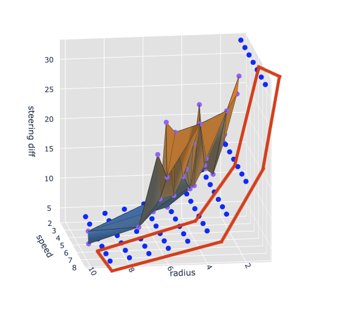

So: the model underestimates the steering diff required to follow a circle of a given radius. It’s even clearer when plotting the difference between the real steering diff and the predicted steering diff using the model:

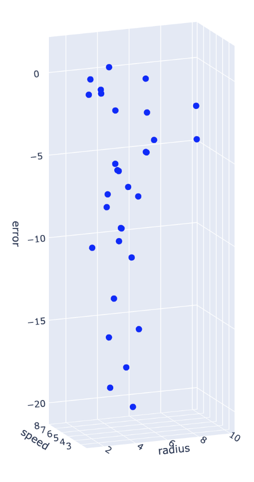

For some points, the model from Section 2 would underestimate the required steering diff by as much as 20 units! An ideal model (not considering overfitting risks) would result in all the points being at a z value of 0 in this graph.

Conclusion: at this point, we have now verified that our model created at low speed is pretty good at low speed, but underestimates the steering diff at high speeds, which not-only makes sense given how we had built it, but also matches with what we’ve observed during testing.

So let’s try to create a better model.

## 4.c. Fitting a better model

The approach in Section 2 was based on a physical model of the vehicle and its kinematics: going from desired radius to steering angle, and then from steering angle to pwm command. But now that we had data linking the pwm command to the radius, we decided to go with an ”end-to-end” approach: building a model that directly maps the desired curvature to the pwm command, without using the steering angle as an intermediate.

Basically, it amounts to going from


to

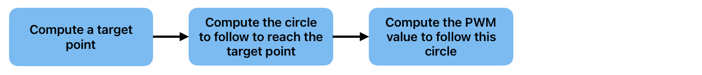

### 4.c.1. Linear and non-linear regressions

The surface does not look like a plane, which means that a linear regression (i.e. a model of the form: $\text{steering\_diff} = \alpha + \beta \times \text{radius} + \gamma \times \text{speed}$) is probably not a good idea. I gave it a try anyway just to see, here is the result:

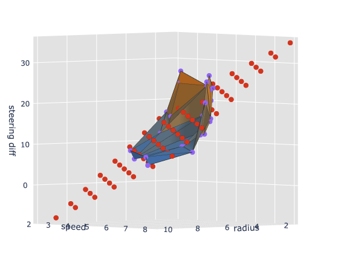

Unsurprisingly, the fit is bad. I also gave it a try with models of dimension 2 and 3:

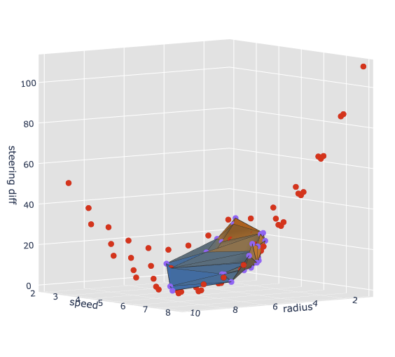

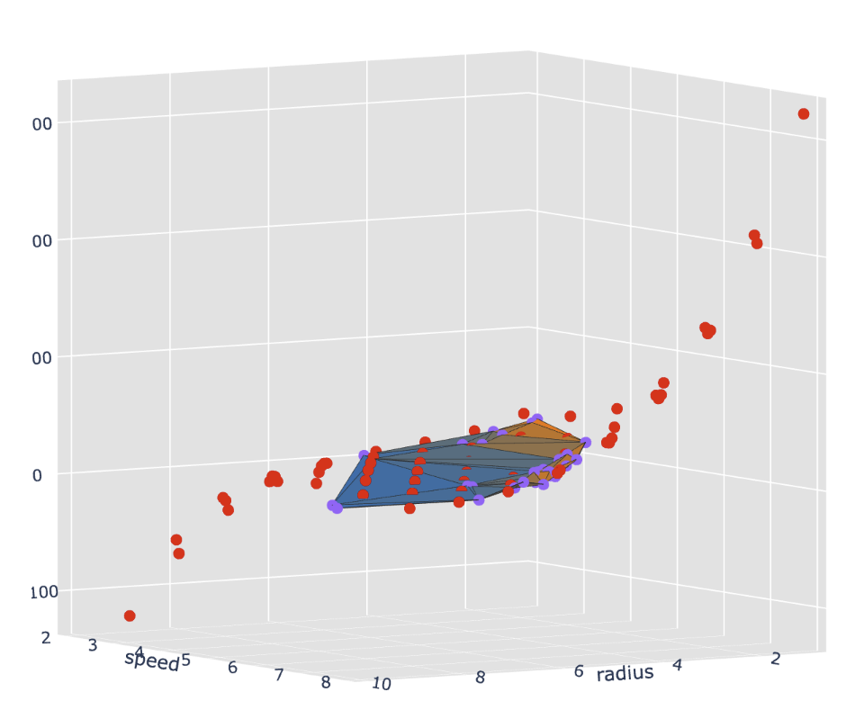

They fit the surface better, but get very bad for radii and speeds far from the points used for training. This would result in pretty bad overfitting, and very bad predictions for the pairs of {speed, radius} outside the ranges used to build the model.

So I had to find something better than linear (or various dimensions) regressions.

### 4.c.2. Nearest neighbors

I also gave a try to k-nearest-neighbors regression:

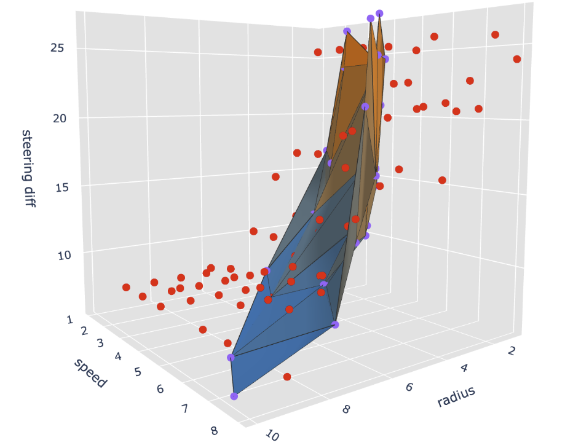

We can see that the performance is very poor, likely because (once again) of the little number of points used to build the model, as well as the fact that are poorly distributed over the ranges of radii and speeds. It was here with k=2 neighbors, but the performance was not better for other values of the number of neighbors.
One remark though, given that the radius and speed are in 2 different units, and possibly in two different ranges, it would be better to normalize the values in a certain range. I don’t think it would help much here, because they happen to be in similar range (roughly between 0 and 10).

### 4.c.3. Same as V1, but regions-based

So, at this point, I did not find a good model to represent the relation between the speed, the steering diff and the radius…

Because the approach from Section 2 was working pretty well at low speeds (and because we needed something to test the very next day), I’ve decided to follow the same approach, but instead of having a single value of the coefficient linking radius and PWM value for the entire speed range, use different coefficients for different speed regions.

Let’s start with the formula we have derived above:

$$
\theta = \arctan(\frac{W}{R}) \text{  and  } \texttt{steering\_diff} = - \theta                \times \frac{\texttt{PWM\_DIFF\_AT\_MAX\_STEER\_ANGLE}}{\texttt{EFFECTIVE\_MAX\_STEER\_ANGLE}}
$$

We combine them and get:

$$
\texttt{steering\_diff} = - \arctan(\frac{W}{R})                \times \frac{\texttt{PWM\_DIFF\_AT\_MAX\_STEER\_ANGLE}}{\texttt{EFFECTIVE\_MAX\_STEER\_ANGLE}}
$$

The term (W / R) will at most be equal to 0.4 / 1.25 = 0.32. Which is *small,* at least enough to justify that we can linearize the `arctan()`, and obtain:

$$
\texttt{steering\_diff} = - \frac{W}{R}              \times \frac{\texttt{PWM\_DIFF\_AT\_MAX\_STEER\_ANGLE}}{\texttt{EFFECTIVE\_MAX\_STEER\_ANGLE}}
$$

Which is the form:

$$
\texttt{steering\_diff} = \frac{\texttt{COEFF}}{R} = \texttt{COEFF} \times \text{curvature}
$$

In the V1 model, COEFF was considered constant. In the updated model, COEFF is not constant anymore, it is a function of the speed:

$$
\texttt{steering\_diff} = \frac{\texttt{coeff}(\texttt{speed})}{R} = \texttt{coeff(speed)} \times \text{curvature}
$$

To keep things simple, I’ve divided the speed space in 4 regions: [0,1.5] ; [1.5,5] ; [5,8] ; [8,+∞]. For each region boundary, I’ve estimated the value of the coefficient from the data, using the formula just above: coeff = steering_diff x R.

Inside a region, the coefficient is a linear interpolation of the values at the two boundaries.
Which, in the end, yields the following algorithm: 

```python
bound_region_1 = 1.5
bound_region_2 = 5
bound_region_3 = 8
coeff_region_1 = 27 * 1.25
coeff_region_2 = 24 * 2.3
coeff_region_3 = 26 * 4

if speed <= bound_region_1:
    coeff = coeff_region_1
elif speed > bound_region_1 and speed <= bound_region_2:
    coeff = coeff_region_1
        + (speed - bound_region_1)
        * (coeff_region_2 - coeff_region_1)
        / (bound_region_2 - bound_region_1) 
elif speed > bound_region_2 and speed <= bound_region_3:
    coeff = coeff_region_2
        + (speed - bound_region_2)
        * (coeff_region_3 - coeff_region_2)
        / (bound_region_3 - bound_region_2)
elif speed > bound_region_3:
    coeff =  coeff_region_3

sterring_diff = curvature * coeff 
return min(27, sterring_diff)  # min is here to avoid crazy large steering values

# see the real implementation in autonomy_software/vehicle_models_pkg/src/vehicle_models_pkg/vehicle_models.py
```

Let’s overlay the real datapoints (purple dots and surface) and points generated with this new model (orange dots):

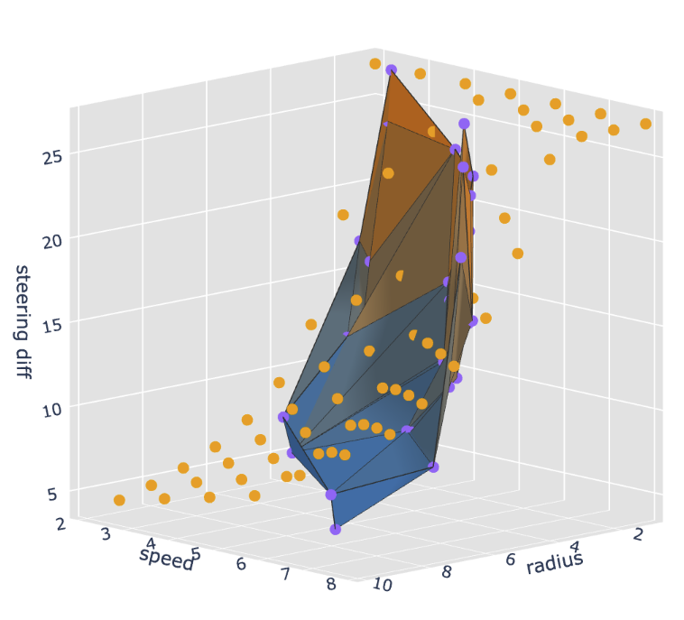

It looks much better than the model from Section 2! Looking at the error this model yields on the measured datapoints, we see that it is much better than the old model (blue is the old model, orange is the new model):

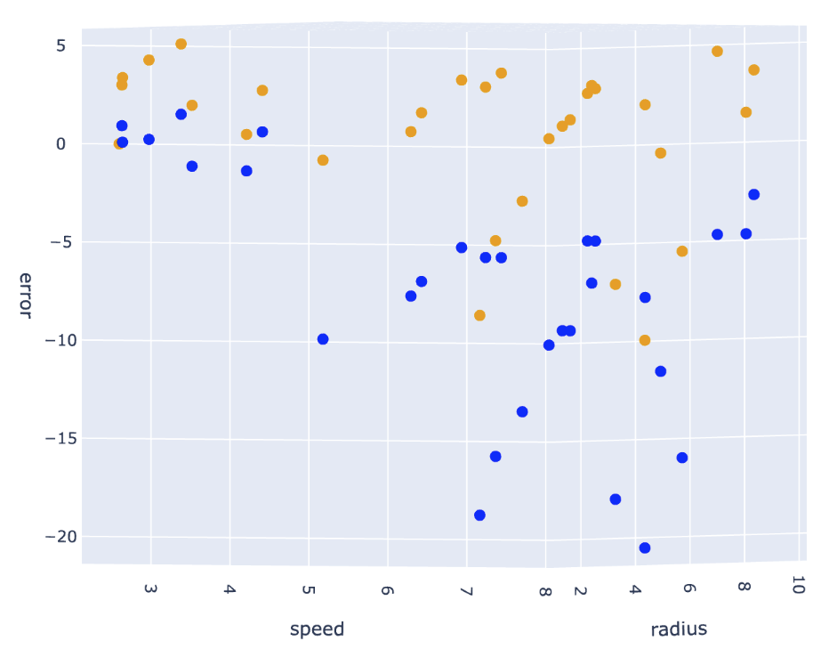

The points are overall much closer to 0, and the largest error is now of ”only” 10 units. It is definitely not perfect though:

- An underestimation of 10 units means that the car will still under-steer pretty heavily in some cases
- The fact that there are some positive error means that the car will over turn in some cases (by up to 5 PWM units), which could lead to instability

This new model is not perfect, but it’s better. When testing it in real life, we’ve confirmed that the car is now able to perform some U-turns that it was not able to do with the previous model.

# 5. Conclusion and next steps - for now

A first and relatively easy next step is to optimize the regions (bounds and associated coefficients) to minimize the error on the training set.
Another next step is to record more datapoints to: either improve the regions-based model, or be able to revisit some of the other models.

