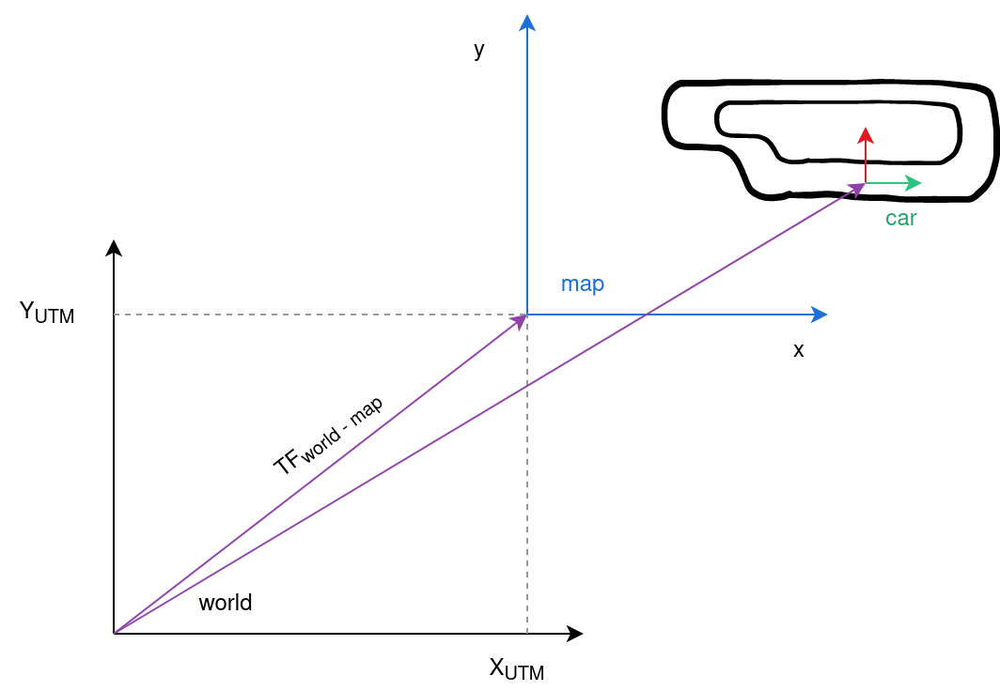
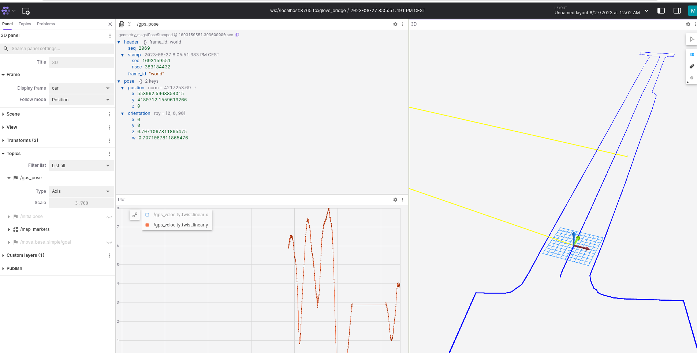
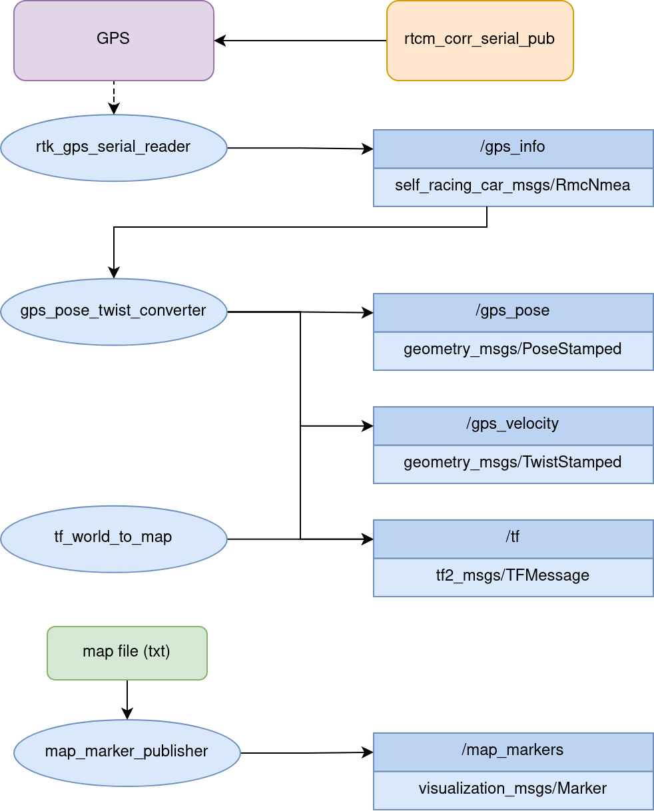

# gps_localization

**`WIP`**

ROS package for GPS localization related nodes

## Launch files
* **map.launch:** launches the **map_marker_publisher** and **tf_world_to_map** nodes

## Nodes

### map_marker_publisher

Node that reads a map (txt file with 2D coordinates of map) and publishes them as markers so they can be visualized.

#### Subscribed topics

None

#### Published topics

* **`map_markers`** ([visualization_msgs/Marker])
	
#### Parameters

* **`map_name`** ([str]): Name of txt file that stores the 2D map points. The file needs to be stored in the **`maps`** folder

### tf_world_to_map

Node that publishes the **`tf`** topic between the **world** frame and the **map** frame. The **world** frame represents the origin in UTM coordinates. The **map** represents an arbitrary origin located close to where a test is performed. The **`tf`** is used to facilitate the visualization in tools such as rviz and foxglove, where we can easily select the frame **map** as the origin of the scene we observe. 

#### Subscribed topics

None

#### Published topics

* **`tf`** ([tf2_msgs/TFMessage]): TF between the frame **world** and **map**. 

#### Parameters

* **`x`** ([int]): X value of the position of the map frame in UTM coordinates
* **`y`** ([int]): Y value of the position of the map frame in UTM coordinates
* All the other parameters (z, yaw, pitch, roll, frame_id, child_frame_id and period_ms) don't need to be modified as they are constant.

### gps_pose_twist_converter

Node that converts the **`gps_info`** topic into more standard ROS message types while also converting the units into the international system of units.

#### Subscribed topics

* **`gps_info`** ([self_racing_car_msgs/RmcNmea]): Topic containing the extracted information from the GPS NMEA sentence read from the serial port.

#### Published topics
* **`gps_pose`** ([geometry_msgs/PoseStamped]): Current position of vehicle in the **world** frame and in **meters**.
* **`gps_velocity`** ([geometry_msgs/TwistStamped]): Current velcoity of vehicle in the **world** frame and in **meters per second**. Contains the x and y components. So the absolute values would have to be calculated differently. Or we could change this and put the absolute value in the x component and change the frame id to **car**, which shouldn't be too inaccurate, assuming the vehicle doesn't slip a lot.
* **`tf`** ([tf2_msgs/TFMessage]): TF between the frame **world** and **car**. 

## How to generate txt file?

See the  **`utm_map_generation`** folder.

## TODO

- Find a better location to save the map files
- Add a try / except when reading the txt file to stop the node cleanly if there is an error?

