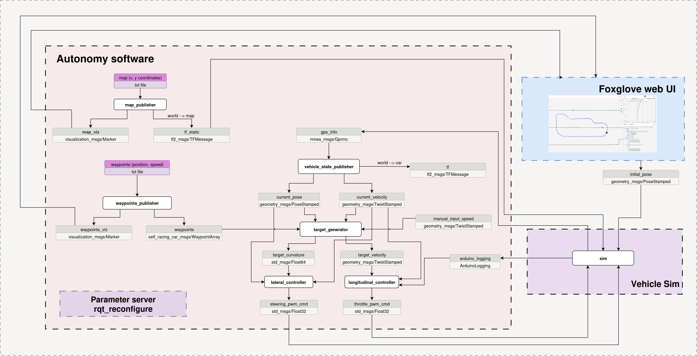
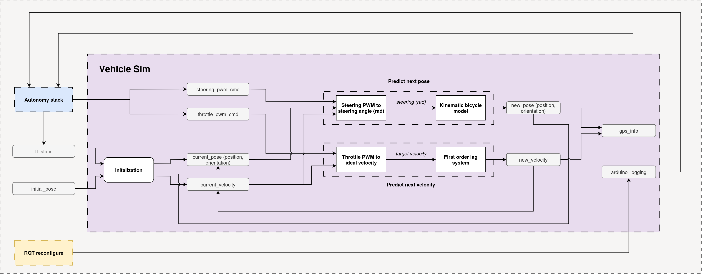

# Vehicle simulator

This package provides a lightweight vehicle simulator designed to test the majority of the nodes running in the actual self driving stack.

## Usage
Use this almost as if you were running an actual vehicle test.

1.
```console
$ cd start_scripts/
$ ./start_infra.sh
$ ./start_sim.sh
```
2. Refresh the dynamic_reconfigure window. Update parameters as needed.
3. Open Foxglove
4. Initialize the position of the vehicle: Open the map view in Foxglove and on the right hand side slick on ```Click to publish``` then click somewhere on the map start the simulation. This will initialize the vehicle stationary in the given position and orientation.

## High level architecture


All the components from the actual self driving stack are running as part of the simulation except the ones related to GPS data acquisition (gps_rtk_serial_reader.py and rtcm_corr_serial_pub.sh) and the firmware running on the arduino.
The sim component has the following inputs:
1. `/tf_static`: The transformation between the world and map frames, published by the map_publisher
2: `/initial_pose`: The initial position published by Foxglove, after the user manually selects an initial position and orientation in the map
3. `/steering_pwm_cmd`: The steering controller's output
4. `/throttle_pwm_cmd`: The speed controller's output

The sim component has the following outputs:
1. `/arduino_logging`: The arduino output topic. In this case it only contains the **engaged_mode** field, which is itself set manually from the **Dynamic Reconfigure** user interface, to simulate the user engaging the remote control or not. If the **engaged_mode** is set to False, the controllers go in a stationary state and the vehicle will stop.
2. `/gps_info`: The nmea sentence containing the vehicle's position, orientation and speed, which is then used by the autonomy stack.

## In more details


The **Predict next pose** component is responsible for updating the vehicle's position and orientation, using it's current state (position, orientation, velocity) and its current steering pwm command. It achieves this in two steps:
1. **Convert steering PWM to steering angle (rad)**: This converts a given steering pwm command into an actual steering angle. This is simplified because the left and right front wheels have different angles, and because of the way it was calculated. This was calculated by setting the steering pwm command a certain value, then measure the trajectory's curvature, then used to calculate the steering angle using a simple bicycle model.
2. **Convert steering angle to new pose**: This calculates the next vehicle's position and orientation using a simple kinematic bicycle model.

The **Predict next velocity** component is reponsible for updating the vehicle's velocity, using it's current velocity and the current throttle pwm command. It achieves this in two steps:
1. **Convert throttle PWM to target velocity**: This converts a given throttle PWM into a target velocity. Assuming a flat surface, this is in theory the velocity the vehicle would reach given this throttle input.
2. **Convert target velocity to current velocity**: To make the simulation a little more realistic, we introduce a first order lag system that updates the vehicle's velocity. It uses a simplified upper-level proportional controller to compute the desired acceleration and assumes a perfect lower-level controller that applies it instantly.


## TODO
- Make the simulator publish a nmea sentence on a serial port, instead of publishing /gps_info
