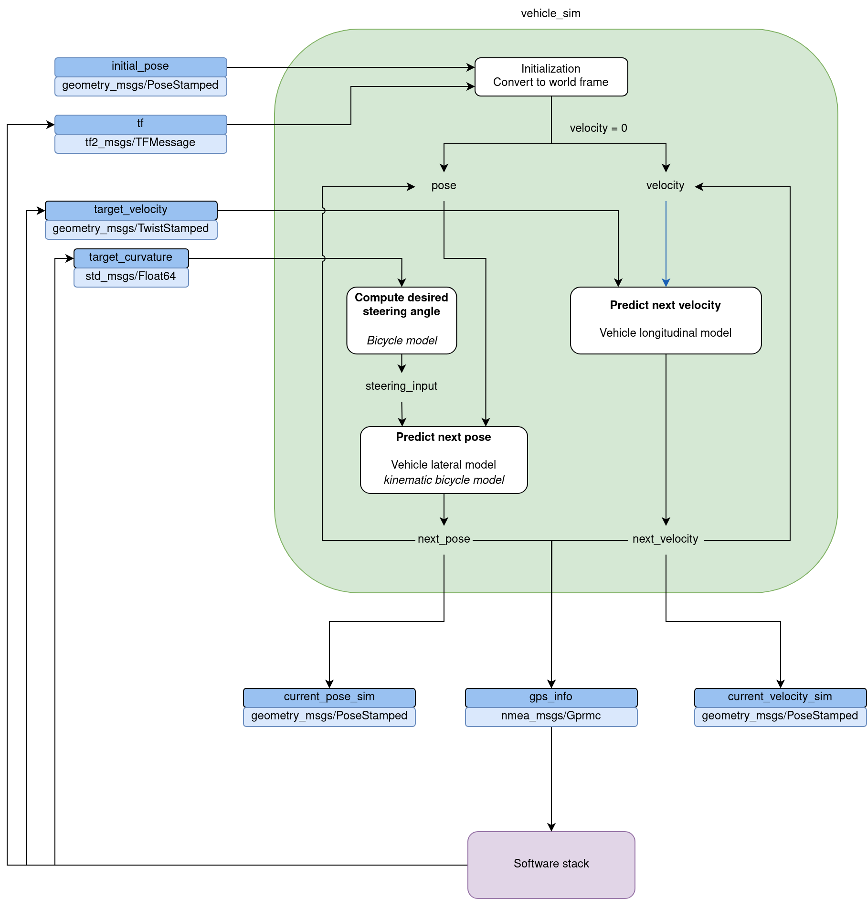

# Vehicle simulator

This package implements a simple vehicle simulator to test some of the nodes in the autonomous driving stack.

## Usage
```console
$ cd start_scripts/
$ ./start_sim.sh
```

This will launch the simulator and parts of the stack that we want to test.

To only start the simulator:
```console
$ source devel/setup.bash
$ rosrun vehicle_sim sim.py
```

To initialize the position of the vehicle, open the map view and on the right hand side slick on ```Click to publish``` then click somewhere on the map start the simulation.

## Diagram


## TODO
- Make the simulator publish a nmea sentence on a serial port, instead of publishing /gps_info
- Create other modes for longitudinal and lateral controller (perfect, delay, with noise ...)
- Add print function to State class
- Add more parameters to vehicle model (max radius, ...)
